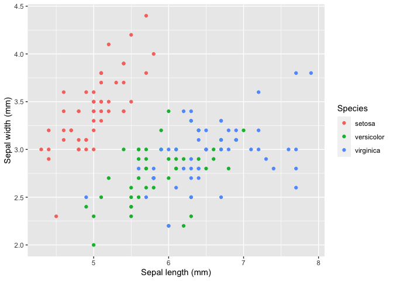
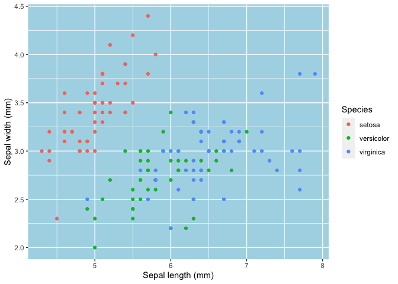
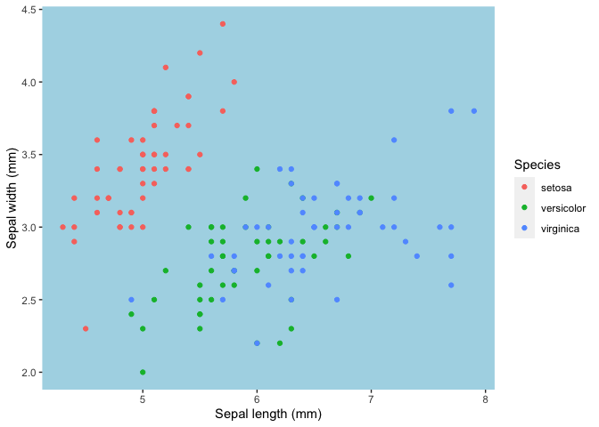
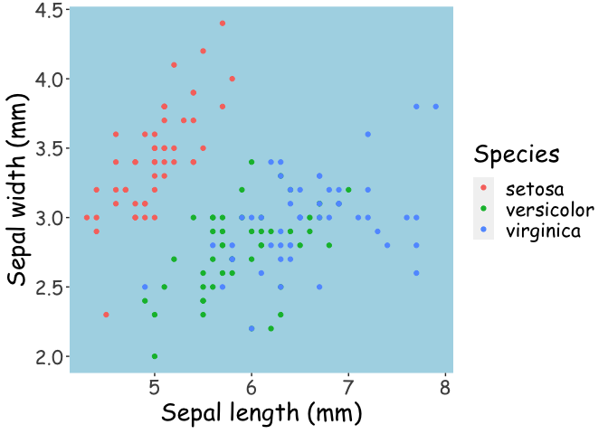
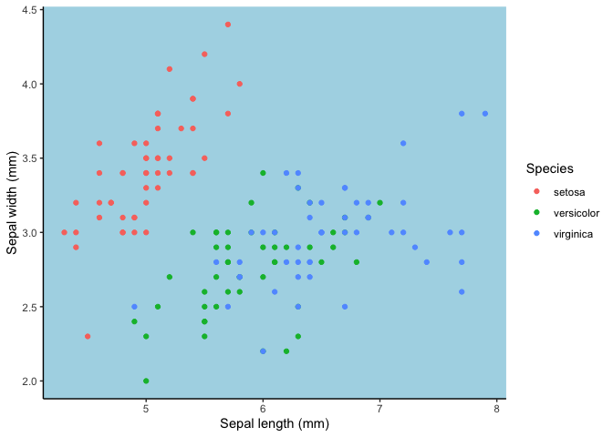
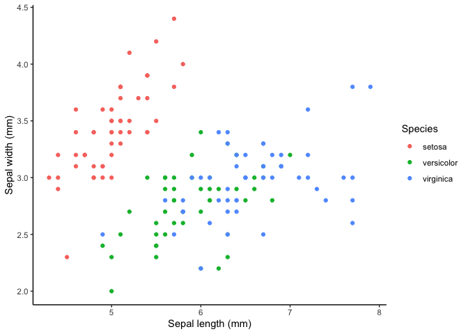

Junk chart challenge
================

### The challenge

Below is a dataset on the carbon footprint of food accessed via the
[Tidy
Tuesday](https://github.com/rfordatascience/tidytuesday/blob/master/data/2020/2020-02-18/readme.md)
project. The data were
[scraped](https://r-tastic.co.uk/post/from-messy-to-tidy/) from the Food
and Agriculture Organization (FAO) of the United Nations [nu3
website](https://www.nu3.de/blogs/nutrition/food-carbon-footprint-index-2018).

Your challenge is to use what you know about creating good data
visualizations to make a [junk chart](https://junkcharts.typepad.com/) -
a visualization that makes your viewers say to themselves,
[“WTF?”](https://viz.wtf/) - a completely ugly, ineffective
visualization. You can visualize any aspect of the data you’d like, but
you do need to include some data (you can’t just plot nothing). You can
wrangle or tidy the data however you see fit. If you still have time,
create an additional “good” visualization. *The only other requirement
is that you need to manually modify one or more components of your
theme* (more on this below).

Use the [data visualization
checklist](https://datainnovationproject.org/wp-content/uploads/2017/04/2_Data-Visualization-Checklist_May2014-2-1.pdf)
to jog your memory about the elements of good data visualizations - then
do the opposite\!

When you are finished, paste your code into this [codeshare
page](https://codeshare.io/78DZZE). Be sure to include your name along
with all code required to create your visualization, including any
wrangling or additional packages. Be prepared to explain your process at
the end of class or at the beginning of our next class.

### Modifying `ggplot` themes

So far, we’ve mostly been using the built-in `ggplot2` themes. However,
you can customize any element of a theme, including font, panel color,
grid thickness, axis tick spacing, and many many others. The function
`theme()` is used to control non-data parts of the graph including :

  - Line elements: axis lines, minor and major grid lines, plot panel
    border, axis ticks background color, etc.
  - Text elements: plot title, axis titles, legend title and text, axis
    tick mark labels, etc.
  - Rectangle elements: plot background, panel background, legend
    background, etc.

There is a specific function to modify each of these three elements :

  - element\_line() to modify the line elements of the theme
  - element\_text() to modify the text elements
  - element\_rect() to change the appearance of the rectangle elements

To modify your theme, start by creating a ggplot as normal:

``` r
ggplot(iris, aes(x = Sepal.Length, y = Sepal.Width, color = Species)) +
  geom_point() +
  labs(x = "Sepal length (mm)",
       y = "Sepal width (mm)")
```

<!-- -->

Then use the `theme()` function, to which you can pass many many element
arguments and additional `element_line()`, `element_text()`, and
`element_rect()` functions. If you want remove a particular theme
element, use `element_blank()`. For example, maybe I want my panel color
to be light blue:

``` r
ggplot(iris, aes(x = Sepal.Length, y = Sepal.Width, color = Species)) +
  geom_point() +
  labs(x = "Sepal length (mm)",
       y = "Sepal width (mm)") +
  theme(panel.background = element_rect(fill = "lightblue"))
```

<!-- -->

and I want to remove the major and minor panel grid lines:

``` r
ggplot(iris, aes(x = Sepal.Length, y = Sepal.Width, color = Species)) +
  geom_point() +
  labs(x = "Sepal length (mm)",
       y = "Sepal width (mm)") +
  theme(panel.background = element_rect(fill = "lightblue"),
        panel.grid.major = element_blank(),
        panel.grid.minor = element_blank())
```

<!-- -->

And maybe I want to use a different, larger font (we’re well on our way
to making a pretty ugly plot at this point…):

``` r
ggplot(iris, aes(x = Sepal.Length, y = Sepal.Width, color = Species)) +
  geom_point() +
  labs(x = "Sepal length (mm)",
       y = "Sepal width (mm)") +
  theme(panel.background = element_rect(fill = "lightblue"),
        panel.grid.major = element_blank(),
        panel.grid.minor = element_blank(),
        text = element_text(size = 20, family = "Comic Sans MS"))
```

<!-- -->

If you plan to change the default theme, and then customize it, you need
to change the theme first, and then modify the theme elements. This
works:

``` r
ggplot(iris, aes(x = Sepal.Length, y = Sepal.Width, color = Species)) +
  geom_point() +
  labs(x = "Sepal length (mm)",
       y = "Sepal width (mm)") +
  theme_classic() +
  theme(panel.background = element_rect(fill = "lightblue"))
```

<!-- -->

This doesn’t because `theme_classic()` overwrites the
`theme(panel.background)` function:

``` r
ggplot(iris, aes(x = Sepal.Length, y = Sepal.Width, color = Species)) +
  geom_point() +
  labs(x = "Sepal length (mm)",
       y = "Sepal width (mm)") +
  theme(panel.background = element_rect(fill = "lightblue")) +
  theme_classic()
```

<!-- -->

### List of `theme()` elements

A full list of `theme()` components and examples on how to modify them
is available on the [ggplot2 reference
page](https://ggplot2.tidyverse.org/reference/theme.html).

### Your junk chart

Create your junk chart here:

If you have time, create your good visualization here:
